# 📊 FLake - Real-time Stock Data Lake Analytics Platform

A comprehensive data lakehouse platform for real-time stock market analytics, built as a school project by three collaborators. This project demonstrates modern data engineering practices including streaming data ingestion, Delta Lake architecture, machine learning integration, and real-time visualization.

     

## 🎯 Project Overview

This platform implements a complete data lakehouse architecture with real-time stock market data processing. It features:

- **Real-time Data Ingestion** with Apache Kafka
- **Multi-layer Delta Lake Architecture** (Bronze → Silver → Gold)
- **Machine Learning Integration** with Spark MLlib
- **Interactive Dashboard** with Streamlit
- **Containerized Deployment** with Docker

## 🏗️ Architecture

```mermaid
graph TB
    A[📡 Data Generator] --> B[Kafka Producer]
    B --> C[Kafka Broker]
    C --> D[🟡 Bronze Layer<br/>Raw Data]
    D --> E[Spark Streaming]
    E --> F[🔵 Silver Layer<br/>Cleaned Data]
    F --> G[Spark ML<br/>Model Training]
    F --> H[Spark SQL<br/>Aggregations]
    G --> I[🟢 Gold Layer<br/>KPIs & Predictions]
    H --> I
    I --> J[📊 Streamlit Dashboard]

    style D fill:#f59e0b
    style F fill:#3b82f6
    style I fill:#10b981
    style J fill:#8b5cf6
```



### Data Pipeline Flow

1. **Bronze Layer**: Raw data ingestion from Kafka streams
2. **Silver Layer**: Data cleaning, validation, and transformation
3. **Gold Layer**: Aggregated KPIs and ML predictions

## 🚀 Quick Start

### Prerequisites

- Docker & Docker Compose
- Git
- At least 8GB RAM (recommended)

### Installation & Setup

1. **Clone the repository**
   ```bash
   git clone https://github.com/bouyassine11/FLake-Delta-Lake.git
   cd FLake-Delta-Lake
   ```

2. **Start the platform**
   ```bash
   docker-compose up --build
   ```

3. **Access the dashboard**
   - Open your browser and navigate to: `http://localhost:8501`
   - The dashboard will automatically start updating with real-time data

### Alternative: Local Development

```bash
# Install dependencies
pip install -r requirements.txt

# Start Kafka (if running locally)
# Start individual services manually:
python data_generator.py     # Terminal 1
python spark_processor.py    # Terminal 2
streamlit run streamlit_app.py  # Terminal 3
```

## 📁 Project Structure

```
FLake-Delta-Lake/
├── 📄 streamlit_app.py          # Main dashboard application (1025 lines)
├── 📄 data_generator.py         # Kafka producer for stock data simulation
├── 📄 spark_processor.py        # Spark streaming pipeline processor
├── 📄 requirements.txt          # Python dependencies
├── 📄 docker-compose.yml        # Multi-container orchestration
├── 📄 Dockerfile.spark          # Spark processor container
├── 📄 Dockerfile.streamlit      # Streamlit dashboard container
├── 📁 storage/                  # Delta Lake data storage
│   ├── bronze_stock/           # Raw data layer
│   ├── silver_stock/           # Cleaned data layer
│   └── gold_stock/             # Aggregated KPIs layer
└── 📁 __pycache__/             # Python cache files
```

## 🛠️ Technology Stack

### Data Processing
- **Apache Spark 3.4.1** - Distributed data processing
- **Delta Lake 2.4.0** - ACID transactions, time travel, schema evolution
- **Apache Kafka 7.3.0** - Real-time data streaming

### Machine Learning
- **Spark MLlib** - Distributed machine learning
- **Random Forest Classifier** - Price direction prediction

### Visualization
- **Streamlit** - Interactive web dashboard
- **Plotly** - Advanced charting and technical indicators

### Infrastructure
- **Docker & Docker Compose** - Container orchestration
- **Python 3.10** - Core programming language

## 📊 Dashboard Features

### Real-time Analytics
- Live stock price charts with technical indicators
- RSI (Relative Strength Index) and MACD signals
- Volume analysis and price change tracking
- Auto-refresh every 5 seconds

### Multi-stock Support
- AAPL, GOOGL, MSFT, AMZN, TSLA
- Comparative performance analysis
- Individual stock deep-dive

### Pipeline Monitoring
- Real-time pipeline health status
- Data flow visualization (Bronze → Silver → Gold)
- Record counts and processing timestamps

### Machine Learning Insights
- Model accuracy gauge (Random Forest: ~72%)
- Feature importance (RSI, MACD, Volatility)
- Prediction confidence metrics

## 🔧 Configuration

### Environment Variables

```bash
# Kafka Configuration
KAFKA_BOOTSTRAP_SERVERS=kafka:9092

# Storage Paths
STORAGE_PATH=/app/storage

# Spark Configuration
SPARK_MASTER=local[*]
```

### Data Schema

```json
{
  "timestamp": "2024-01-10T12:00:00Z",
  "symbol": "AAPL",
  "price": 150.25,
  "volume": 15420,
  "rsi": 65.4,
  "macd": 0.85,
  "volatility": 2.1,
  "price_change": 1.25,
  "price_direction": 1,
  "volume_change": 234
}
```

## 🧠 Machine Learning Pipeline

### Model Details
- **Algorithm**: Random Forest Classifier
- **Target**: Price direction (0: down, 1: up)
- **Features**: RSI, MACD, Volatility, Price Change, Volume Change
- **Training**: Every 5 batches on streaming data
- **Accuracy**: ~72% (varies with market conditions)

### Training Process
```python
# Feature engineering
features = ["rsi", "macd", "volatility", "price_change", "volume_change"]
assembler = VectorAssembler(inputCols=features, outputCol="features")

# Model training
model = RandomForestClassifier(
    featuresCol="features",
    labelCol="price_direction",
    numTrees=20,
    maxDepth=5
)
```

## 📈 Performance Metrics

### Data Throughput
- **Ingestion Rate**: 1 message/second (configurable)
- **Processing Latency**: < 10 seconds end-to-end
- **Storage**: Delta Lake with automatic optimization

### System Requirements
- **RAM**: 8GB minimum, 16GB recommended
- **CPU**: Multi-core processor for Spark parallelism
- **Storage**: 10GB+ for data lake and checkpoints

## 🐛 Troubleshooting

### Common Issues

1. **Kafka Connection Issues**
   ```bash
   # Check Kafka logs
   docker-compose logs kafka

   # Restart services
   docker-compose restart
   ```

2. **Spark Memory Errors**
   ```bash
   # Increase memory in docker-compose.yml
   environment:
     - SPARK_DRIVER_MEMORY=4g
     - SPARK_EXECUTOR_MEMORY=4g
   ```

3. **Delta Lake Corruption**
   ```bash
   # Clean and restart
   docker-compose down
   rm -rf storage/
   docker-compose up --build
   ```

### Pipeline Reset
```bash
# Stop all services
docker-compose down

# Clean data and checkpoints
rm -rf storage/

# Restart fresh
docker-compose up --build
```

## 🤝 Contributors

This project was built as a collaborative school project by:

- **Anas Roukhmi**  
- **Yassine Bouyahia**
- **Abdelkrim Rekbi** 

## 📚 Learning Outcomes

Through this project, we gained expertise in:

- **Data Engineering**: Building scalable data pipelines
- **Big Data Technologies**: Spark, Kafka, Delta Lake
- **Machine Learning**: Real-time model training and deployment
- **DevOps**: Containerization and orchestration
- **Real-time Analytics**: Streaming data processing
- **Data Visualization**: Interactive dashboard development

## 🔄 Future Enhancements

- [ ] **Additional ML Models**: LSTM for time series prediction
- [ ] **External Data Sources**: Real market data integration
- [ ] **Advanced Analytics**: Portfolio optimization algorithms
- [ ] **Alerting System**: Price threshold notifications
- [ ] **Multi-asset Support**: Crypto, forex, commodities
- [ ] **Cloud Deployment**: AWS/GCP/Azure integration

## 📄 License

This project is developed for educational purposes as part of a school assignment.

## 🙏 Acknowledgments

- **Apache Spark** community for the powerful data processing framework
- **Delta Lake** team for the lakehouse architecture
- **Streamlit** for the amazing dashboard framework
- **Confluent** for Kafka and streaming expertise

---


